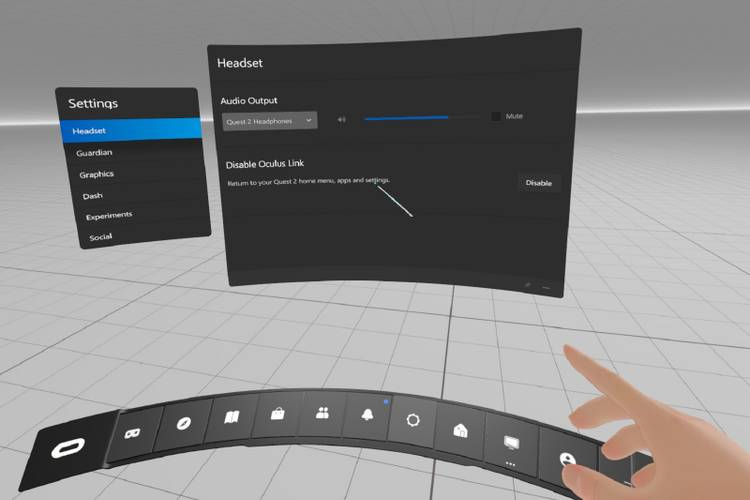

# dot-chaser
Built with Unity. An observational experiment investigating the retinotopic flow patterns generated by visual search + ground fixations during locomotion.

## Setup Instructions

1) Clone this repository in a Unity project (version 2022.3.xxxx).

2) Make sure you have the [Meta All-in-one SDK](https://assetstore.unity.com/packages/p/meta-xr-all-in-one-sdk-269657) installed in your project.

3) Make sure your project is configured for XR (Edit --> Project Settings --> XR Plugin Management (install and check the "Oculus" box)).

4) Make sure the [Meta Quest Link](https://www.meta.com/help/quest/1517439565442928/) client is configured correctly:

    4a) Once your Quest Pro is plugged into the PC, it should be recognized in the client.

    4b) Ensure eye tracking is enabled (Settings --> Beta --> check "Eye tracking over Meta Quest Link" and "Face tracking over Meta Quest Link")

    4c) Make sure the active OpenXR runtime is set to Meta Quest Link (Settings --> General tab)

5) Put on the HMD and enter the Quest Link app (should be a white, gridded environment like the screenshot below)


## Dev Notes: 2025-04-01

Fixed dotBehavior, working on trial information now. Doing this in `ExperimentManager`

ChatGPT's explanation of the changes it made to the trial info (that I mostly trust but want to work to understand before proceeding):

Explanation:

`TrialInfo` Class: Represents each trial's data with properties for TrialNumber and TrialType.

`trialInfoList`: A List<TrialInfo> to store all parsed trial data.

`ParseCSV` Method: Reads the CSV content, skips the header, and populates the `trialInfoList`.

`GetTrialInfo` Method: Allows you to retrieve a specific trial's information by its trial number.
Usage:

You can now access the trial data in your experiment logic using the `trialInfoList` or the `GetTrialInfo` method. For example:
```c#
TrialInfo currentTrial = GetTrialInfo(trialNumber);
Debug.Log($"Current Trial Type: {currentTrial.TrialType}");
```
This setup will allow you to dictate the experiment's behavior based on the trial data in the CSV file.

## Dev Notes: 2025-03-31
`Trent`

- I added a "GroundPlane" tag to the floor (`VirtualEnv`), so that it's grabbed automatically on experiment start. I also added "Player" tag to the `OVRCameraRig` to register in sphere (dot) collider interactions.
- Edited Braden's SpawnBehavior code, called it `DotBehavior` and changed some of the parameters to randomize the location within a certain distance of the participant (player) - trying randomly at first and then spawning the dot towards the middle of the floor if random selection fails.

TODO: 
1. Work on the "player" triggered behavior with the dot, maybe explore capsule collider instead of sphere so that participant can almost stand over the dot by the end of every trial
2. the size of the ground plane feels off to me, like too big. Need to figure out eye height of HMD (make sure it's right) and then make sure the size of the room/ground plane is appropriate
3. Talk to Niall about building to device
4. Make sure we're recording data so we can recreate the visual scene
5. Implement a trial structure
6. Implement "blunt" perturbations -- meaning easy to pull off (global world translation/rotation)
7. Integrate Motion Analysis;; most likely recording in parallel so that Unity isn't awar of the motion capture

## Dev Notes: 2025-02-17

I (Niall) added updated eye tracking and logging. Still need to verify that we are logging the correct gaze vector (local eye-in-head vector vs world-space vector).

You *should* be able to just clone this repository and have the necessary Meta SDK and client installed and it should work out of the box. No need to build to the device. Just plug in the HMD into the PC (using a high-bandwidth USB cable), make sure that eye tracking and facial expressions over link cable are enabled in the *Meta Quest Link* Windows client, open Quest Link in the HMD, and press the Play button in Unity.

Note: I updated the project to Unity v2022.3.49f1.g

## Dev Notes: 2024-08-16

Eyeball position and rotation is recorded via the `EyeDataWriter.cs` script by its connection to the `Experiment Eye Gaze Right/Left` Game Object + the `ExperimentEyeGaze.cs` script. `ExperimentEyeGaze.cs` is a customized version of the `OVREyeGaze.cs` script, with only one line of code changed:

*Lines 87-89 of `ExperimentEyeGaze.cs`*
``` C#
// Trent Added 2024-06-06
    public event Action<Quaternion, Vector3> EyeRotationUpdated;
// end of Trent Added
```

### Critical to recording Eye Position: 

On the `Experiment Eye Gaze Right/Left` Game Objects, for the `ExperimentEyeGaze.cs` script, "World Space" needs to be selected for the `Tracking Mode` dropdown menu.

